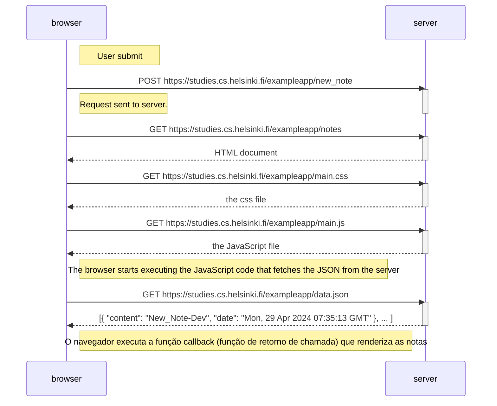

```mermaid
    sequenceDiagram

      participant browser

      participant server

            Note right of browser: User submit
            browser->>server: POST https://studies.cs.helsinki.fi/exampleapp/new_note
            activate server 
            Note right of browser: Request sent to server.            
            deactivate server
                
            browser->>server: GET https://studies.cs.helsinki.fi/exampleapp/notes
            activate server
            server-->>browser: HTML document
            deactivate server
    
            browser->>server: GET https://studies.cs.helsinki.fi/exampleapp/main.css
            activate server
            server-->>browser: the css file
            deactivate server
    
            browser->>server: GET https://studies.cs.helsinki.fi/exampleapp/main.js
            activate server
            server-->>browser: the JavaScript file
            deactivate server
    
            Note right of browser: The browser starts executing the JavaScript code that fetches the JSON from the server 
            browser->>server: GET https://studies.cs.helsinki.fi/exampleapp/data.json
            activate server
            server-->>browser: [{  "content": "New_Note-Dev", "date": "Mon, 29 Apr 2024 07:35:13 GMT" }, ... ]
            deactivate server
            Note right of browser: O navegador executa a função callback (função de retorno de chamada) que renderiza as notas
```
