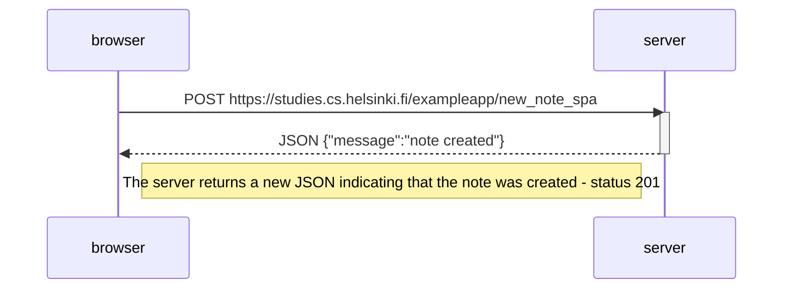

```mermaid
   sequenceDiagram

    participant browser

    participant server

    browser->>server: POST https://studies.cs.helsinki.fi/exampleapp/new_note_spa
    activate server
    server-->>browser: JSON {"message":"note created"}
    deactivate server
    Note right of browser: The server returns a new JSON indicating that the note was created - status 201
```
